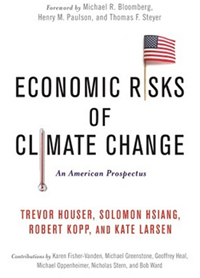

I am a climate scientist, geobiologist, and climate policy scholar. I serve at [Rutgers University](http://www.rutgers.edu/) as Director of the [Institute of Earth, Ocean & Atmospheric Sciences](http://eoas.rutgers.edu/) and as a professor in
the [Department of Earth & Planetary Sciences](http://geology.rutgers.edu/).  

I also co-direct Rutgers' transdisciplinary [Coastal Climate Risk & Resilience (C2R2) initiative](http://c2r2.rutgers.edu), a training program which brings graduate students in the natural sciences, social sciences, engineering, and urban planning together with coastal stakeholders to tackle the challenges that climate change poses to the world's coastlines.

I'm one of the directors of the [Climate Impact Lab](http://www.impactlab.org), a collaboration of more than two dozen climate scientists, economists, data scientists and policy scholars, working to bring Big Data approaches to the assessment of the economic risks of climate change.

My [research](research/) focuses on understanding uncertainty in past and future climate change, with major emphases on sea-level change and on the interactions between physical climate change and the economy.

I am a lead author of the U.S. Global Change Research Program's 2017 [_Climate Science Special Report_](https://science2017.globalchange.gov) and of [_Economic Risks of Climate Change: An American Prospectus_](http://www.climateprospectus.org/). I was a contributing author to the [Intergovernmental Panel on Climate Change](http://www.ipcc.ch)’s Fifth Assessment Report, and have served on sea-level rise expert groups for several states and and cities. 

In addition to the  Rutgers  [Department of Earth & Planetary Sciences](http://geology.rutgers.edu/) and the
[Institute of Earth, Ocean, and Atmospheric Sciences](http://eoas.rutgers.edu/), I am also a member of the [Rutgers Climate Institute](http://climatechange.rutgers.edu) and the [Rutgers Energy Institute](http://rei.rutgers.edu/). I am affiliated with Rutgers graduate programs in [Atmospheric Sciences](http://atmos.rutgers.edu), [Geological Sciences](http://eps.rutgers.edu), [Oceanography](http://marine.rutgers.edu), [Statistics](http://statistics.rutgers.edu), and [Planning and Public Policy](http://policy.rutgers.edu/).

Prior to joining the Rutgers faculty, I served as a [AAAS Science & Technology Policy Fellow](http://fellowships.aaas.org/) in the [U.S. ](http://www.energy.gov)[Department of Energy](http://www.energy.gov)'s Office of Policy and International Affairs and as a [Science, Technology, and Environmental Policy](http://www.princeton.edu/step/) postdoctoral research fellow at Princeton University. I received my Ph.D. in geobiology from Caltech and my undergraduate degree in geophysical sciences from the University of Chicago. 

 

     
    <h2><a href="{{ site.url}}/posts/">Recent Posts</a></h2>
    
      
    <article>
      
        <h4 class="link-post"><a href="{{ site.url }}{{ post.url }}" title="{{ post.title }}">{{ post.title }}</a> <a href="{{ post.link }}" target="_blank" title="{{ post.title }}"><i class="fa fa-link"></i></a></h4>
      
        <h4><a href="{{ site.url }}{{ post.url }}" title="{{ post.title }}">{{ post.title }}</a></h4>
        
{{ post.excerpt | strip_html | truncate: 160 }}

      
    </article>
    
	
	
<!-- /#index -->

#### [In the media](http://www.google.com/search?hl=en&gl=us&tbm=nws&q="Robert+Kopp"+OR+"Bob+Kopp"+Rutgers)

* [Radio Times with Mary Cummings-Jordan [WHYY] (November 2018)](https://goo.gl/H2Q4oa)
* [Science Friday (November 2018)](https://goo.gl/JVgHNp)
* [E&E News Off Topic (November 2018)](https://goo.gl/M2FfqL)
* [Reddit AMA (December 2017)](https://doi.org/10.15200/winn.151213.32636)
* [_New York Times_ (November 2017)](https://nyti.ms/2hLb7MS)
* [_The Conversation_ (June 2017)](https://goo.gl/EvRo1X)
* [_The Conversation_ (November 2016)](https://goo.gl/OWovmZ)
* [_The Conversation_ (June 2016)](https://goo.gl/nOadXV)
* [Radio Times with Marty Moss-Coane [WHYY] (February 2016)](http://goo.gl/zWLUsW)
*  [PRI's The World (February 2016)](http://goo.gl/RuhXl3)
* [_New York Times_ Sunday Review (June 2015)](http://nyti.ms/1JyXkk7)
* [_Rutgers Today_ (Dec. 2014)](http://news.rutgers.edu/feature/earth-scientists-urgent-mission-takes-shape-rutgers/20141217)
* [Radio Times with Marty Moss-Coane [WHYY] (July 2014)](http://goo.gl/DfPnc9)
* [_New York Times_ Sunday Review (Nov. 2012)](http://nyti.ms/TcArGg)

