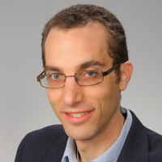
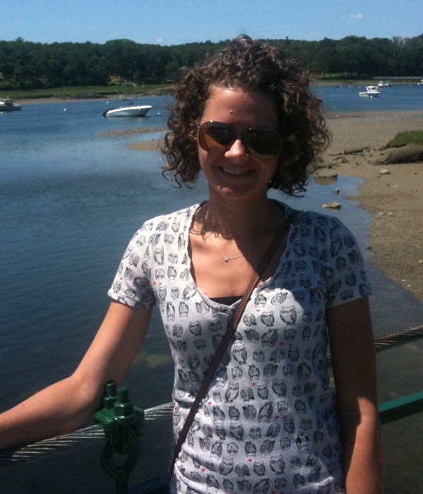
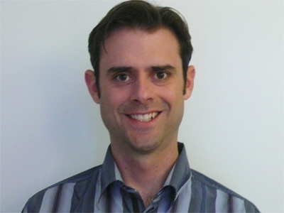
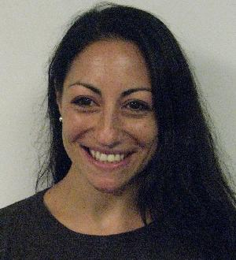
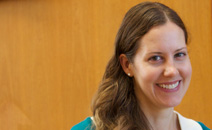
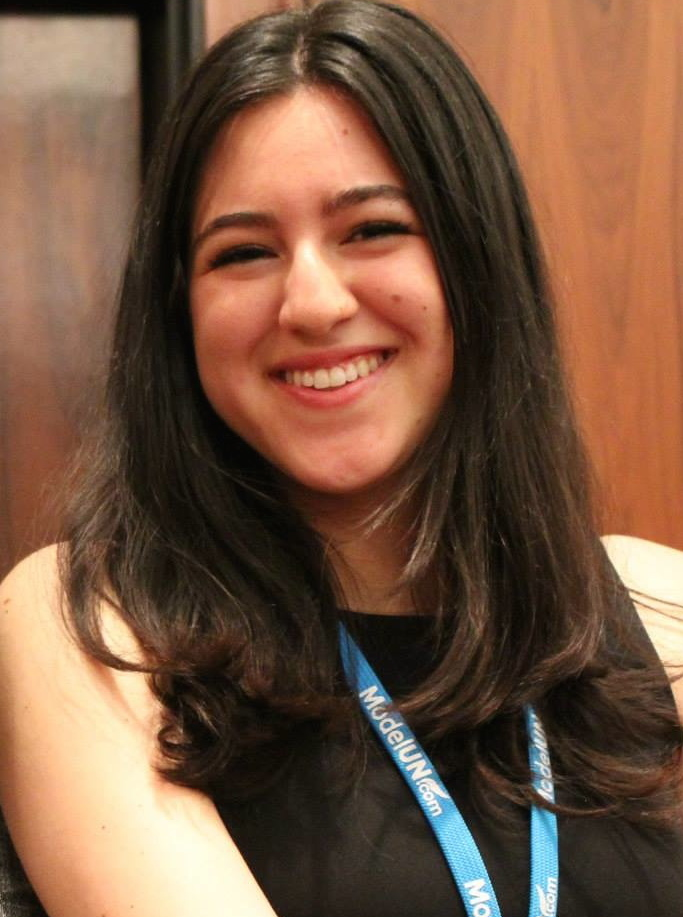

<section id="table-of-contents" class="toc">

*  Auto generated table of contents
{:toc}

</section><!-- /#table-of-contents -->

#### [Bob Kopp, Group Director](/)
{:.no_toc}

<a href="/">

</a>

 I am a climate scientist, Earth historian, geobiologist, and energy policy wonk. My research focuses on understanding uncertainty in past and future climate change, with major emphases on sea-level
change and on the interactions between physical climate change and the economy.

### Postdocs

#### [Carling Hay (Joint Rutgers/Harvard Postdoc)](https://www.linkedin.com/profile/view?id=285982903)
{:.no_toc} 

<a href="https://www.linkedin.com/profile/view?id=285982903">

</a>
One of the main goals of my work is to answer the fundamentally important climatological question:  what are the various contributors to the observed changes in sea level?  My research focuses on using statistical techniques to better understand global mean sea level during current and past warm periods, and to develop the tools necessary to extract source information from historical sea-level records.  Understanding how past sea level has changed in response to rising surface temperatures is a critical step in being able to predict sea-level rise into the next century and beyond.

#### [Eric Morrow](https://www.linkedin.com/profile/view?id=88942342)
{:.no_toc}

<a href="https://www.linkedin.com/profile/view?id=88942342">

</a>
I am a scientist and professional engineer who loves helping people derive novel insight from complex data. I began my career in the aerospace industry developing the systems that orient spacecraft in orbit and was on the operations support teams for several satellite missions, notably NASA’s ChipSat, Australia’s FedSat and Canada’s MOST programs. From there I moved to a more client-facing role supporting robotic operations to assemble the International Space Station. I then began my journey Earth-ward and worked on the development of an instrumentation platform for an airborne gravity gradiometer designed geophysical exploration. The latest accomplishment in my career path has been the completion of a PhD in geophysics from Harvard University that focused on using statistics, machine learning and physics with large data sets to estimate how our oceans have changed over the past century in the face of on-going climate change.

### Graduate students

#### [Erica Ashe  (Statistics)](https://www.linkedin.com/profile/view?id=10136757)
{:.no_toc}

<a href="https://www.linkedin.com/profile/view?id=10136757">

</a>
Statistics is the mathematical body of science pertaining to collection, organization, analysis, interpretation and presentation of data.  The complex nature of the spatial and temporal data used for
climate process reconstruction produces unique statistical challenges, which highlight the importance of interdisciplinary research.  Without an understanding of the scientific processes underlying
observable data, as well as the theoretical foundations of the statistical tools used in analysis, the data may be misinterpreted.  I am interested in applying this theory to the current problems in
prediction and forecasting, as well as modeling, of the relationships between sea level and ice sheet volumes over time and space, as they relate to unobservable parameters of the geoid.  Using
commonly accepted ice sheet histories and earth parameter profiles, including different lithospheric thicknesses, and upper and lower mantle viscosities, I am developing a stochastic emulator of the
sea-level equation.

#### [Maya Buchanan (Woodrow Wilson School)](https://www.linkedin.com/profile/view?id=22120048) 
{: .no_toc}

<a href="https://www.linkedin.com/profile/view?id=22120048">

</a>
Maya grew up in Salt Lake City, Utah. Fascinated with water availability in the Middle East, she started her career developing integrated water resources projects for the World Conservation Union, the
United Nations and CDM engineering in Jordan. As a Fulbright Fellow, she modeled water scarcity amidst climate change. Maya later worked on federal sustainability and Earth science projects for the
Architect of the Capitol, Department of Energy, and NASA. Most recently, she worked for the White House Subcommittee on Global Change Research on developing the U.S. Government's priorities in
advancing climate science and informing decision makers. Maya’s research interests lie in optimizing resilience to climate change impacts, particularly to sea level rise in the face of multiple
economic and social stressors.

#### Kendra McKoy (Geological Sciences)
{:.no_toc}

### Undergraduate students

#### Rachel DiSciullo (Philosophy/Political Science)
{:.no_toc}

<a href="">

</a>

### Alumni

#### Graduate students co-advised
{:.no_toc}

* [R.D. Baluyot](https://www.linkedin.com/pub/ronidell-baluyot/72/2b5/359), Rutgers M.S. '13 in Geological Sciences
* [Joe Majkut](https://www.linkedin.com/pub/joseph-majkut/4b/485/683), Princeton  Ph.D. '14 in Atmosphere & Ocean Sciences
* [Shankar Chandramowli](https://www.linkedin.com/pub/shankar-chandramowli/10/4a9/78), Rutgers Ph.D. '15 in Public Policy

#### Undergraduate students
{:.no_toc}

* Corie Hlavaty (senior thesis student; BS '13 in Geological Sciences)
* [Kinan Tadmori](https://www.linkedin.com/pub/kinan-tadmori/b0/42a/212) (undergraduate research assistant, 2012-2013; BS '15 in Biological Sciences/Environmental Policy)
* Andrew Wang (undergraduate research assistant, 2012-2013; BS '15 in Mechanical Engineering)
* [Zeal Shah](https://www.linkedin.com/pub/zeal-shah/a3/902/353) (undergraduate research assistant, 2013-2014; BS '15 in Mechanical Engineering)
* [Emily Zee](https://www.linkedin.com/pub/emily-zee/89/19a/56) (undergraduate research assistant, 2013-2014; BS '16 in Mechanical Engineering)

