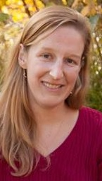
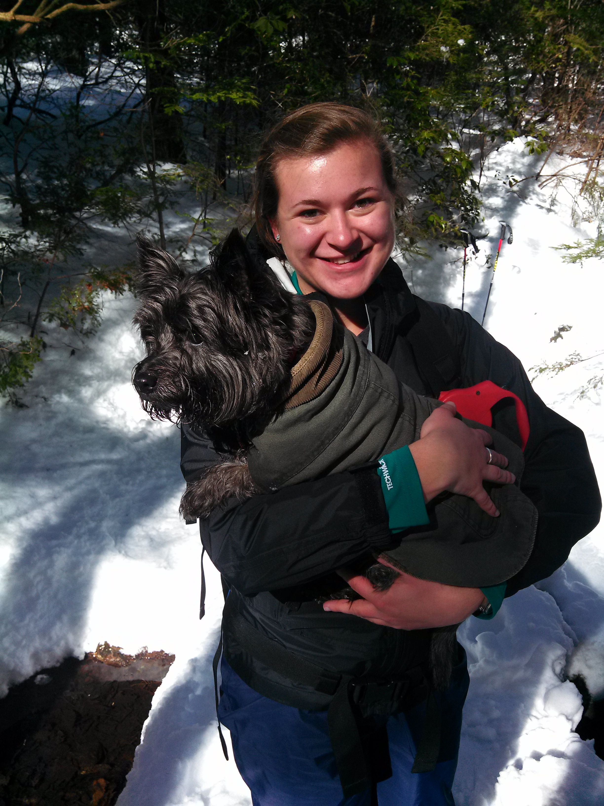

<section id="table-of-contents" class="toc">

*  Auto generated table of contents
{:toc}

</section><!-- /#table-of-contents -->

The Rutgers Earth System Science & Policy Lab takes a transdisciplinary, computationally intensive approach to investigating the evolution of the Earth system, human influences on the Earth system, and policy approaches for managing those human influences. We heavily employ the techniques of Bayesian statistics, geophysical and geochemical modeling, integrated assessment modeling, and quantitative risk analysis. 

Major projects within our Lab at the moment include:

* reconstructing sea-level and ice-sheet changes on timescales ranging from the 20th century, to the late Holocene, to the last 150 thousand years, through statistical and geophysical modeling of geological and observational records;
* probabilistically projecting future changes in sea levels and their implications for changing coastal flood risk, and translating those projected changes into actionable information for coastal adaptation; and
* linking probabilistic simple climate models, complex Earth system models, and econometric analyses of historical weathering and climate impacts to project future risks associated with climate change and improve estimates of the social cost of carbon.

We have close collaborations with colleagues at the [Rutgers Sea Level Lab](http://sealevel.marine.rutgers.edu), the [Princeton Science, Technology & Environmental Policy program](https://www.princeton.edu/step/), the [Harvard Sea Level Dynamics group](http://isites.harvard.edu/icb/icb.do?keyword=k92805),  and the [Berkeley Global Policy Lab](http://www.solomonhsiang.com/lab).

We welcome applications from potential graduate students and postdocs with strong computational skills who want to join our group's eclectic mix of statisticians, geophysicists, climate modelers, and policy scholars. Contact [Bob Kopp](../contact/) for more information.

## People

#### [Bob Kopp, Group Director](/)
{:.no_toc}

<a href="/">

</a>

 I am a climate scientist, Earth historian, geobiologist, and energy policy wonk. My research focuses on understanding uncertainty in past and future climate change, with major emphases on sea-level
change and on the interactions between physical climate change and the economy.

### Postdocs

#### [Jiacan Yuan](http://www.meteo.psu.edu/~juy17/)
{:.no_toc}

<a href="http://www.meteo.psu.edu/~juy17/">

</a>
I am a climatologist who is interested in understanding the fundamental dynamical processes in the atmosphere and improving climate models, which could give us better predictive power and risk assessment of the changing climate. My research apparatus is built with a fusion of advanced statistical methods, idealized general circulation models (GCM), and state of the art climate models. At present, my research is focused on assessing economic risks from the projection of future climate. I have worked on several projects on climate dynamics, including the response of large-scale circulations in the warming climate, its effects on regional weather patterns and extreme events, tropical influence on midlatitude weather, and dynamical mechanisms of subseasonal variability of midlatitude jet streams.  

#### [Andra Garner](https://sites.google.com/site/andrajreed/)
{:.no_toc}

<a href="https://sites.google.com/site/andrajreed/">

</a>
 I am currently an NSF Earth Sciences Postdoctoral Fellow, working with the Sea Level Research group and the Earth System Science and Policy Lab at Rutgers University. My research focuses on changing flood risk in New York City during the past millennium and in coming centuries due to tropical cyclones, storm surge, and sea level rise. I earned my Ph.D. from Penn State University in August 2016, working with Dr. Michael E. Mann in the Department of Meteorology.  A brief portion of my graduate research was in the field of atmospheric chemistry, focusing on a comparison of ground and satellite-based retrievals of ozone and nitrogen dioxide. However, my true research interests lie in the realm of climate science, where focus upon the impacts of climate change on tropical cyclones and their resultant storm surges, as well as on the rising sea levels upon which those storm surges occur.

### Graduate students

#### [Erica Ashe  (Statistics)](https://www.linkedin.com/in/erica-ashe-21948a3/)
{:.no_toc}

<a href="https://www.linkedin.com/in/erica-ashe-21948a3/">

</a>
Statistics is the mathematical body of science pertaining to collection, organization, analysis, interpretation and presentation of data.  The complex nature of the spatial and temporal data used for
climate process reconstruction produces unique statistical challenges, which highlight the importance of interdisciplinary research.  Without an understanding of the scientific processes underlying
observable data, as well as the theoretical foundations of the statistical tools used in analysis, the data may be misinterpreted.  I am interested in applying this theory to the current problems in
prediction and forecasting, as well as modeling, of the relationships between sea level and ice sheet volumes over time and space, as they relate to unobservable parameters of the geoid.  Using
commonly accepted ice sheet histories and earth parameter profiles, including different lithospheric thicknesses, and upper and lower mantle viscosities, I am developing a stochastic emulator of the
sea-level equation.

#### [Maya Buchanan (Woodrow Wilson School)](https://www.linkedin.com/in/maya-buchanan-b544a87/) 
{: .no_toc}

<a href="https://www.linkedin.com/in/maya-buchanan-b544a87/">

</a>
I am an interdisciplinary environmental scientist who applies climate science to policy applications and decision-making problems under uncertainty. My interests lie in assessing dynamics between climate impacts and social and natural systems. My research involves optimizing resilience to climate change impacts, particularly to sea level rise in the face of multiple economic and social stressors. Before starting my PhD, I worked for the White House Subcommittee on Global Change Research on developing the U.S. Government's priorities in advancing climate science and informing decision makers. Previously, I worked as an environmental engineer and policy analyst for NASA, the Department of Energy, the Architect of the Capital, and the United Nations (Iraq and Jordan field offices). 

#### [Kristen Joyse (Earth and Planetary Sciences)](http://geology.rutgers.edu/people-directory/24-graduate-students/707-kristen-joyse)
{: .no_toc}

<a href="http://geology.rutgers.edu/people-directory/24-graduate-students/707-kristen-joyse">

</a>
I am a geoscientist interested in using evidence of past climate change to improve understanding of physical Earth systems and projections of future climate. My interests lie particularly within aspects of climate that have large social implications, including sea level rise, major storm frequency, and resource availability. I am currently a member of Rutgers University’s first cohort of trainees in the Coastal Climate Risk and Resilience initiative, which focuses on the transdisciplinary research and collaboration I am interested in. My current research is focused on relative sea level rise in the Western Mediterranean Basin and its implications for past civilizations. Additionally, I am working on a paleostorm reconstruction for the New Jersey coast from overwash deposits in backbarrier environments.

#### [D.J. Rasmussen (Woodrow Wilson School)](http://www.djrasmussen.co ) 
{: .no_toc}

<a href="http://www.djrasmussen.co">

</a>
DJ’s interests lie at the intersection of climate, policy, and the economy. He uses computational models and large data sets to assess risks posed by weather and climate. DJ was a research fellow at the National Oceanic and Atmospheric Administration’s (NOAA) Geophysical Fluid Dynamics Laboratory (GFDL). He later contributed to the physical climate projection work for the technical analysis underlying the Risky Business Project — an initiative to quantify and publicize the economic risks from the impacts of a changing climate — and was more recently a senior associate engineer at Ramboll Environ, located in the San Francisco Bay Area. DJ has a BS in atmospheric science and an MS in civil and environmental engineering.

### Alumni

#### Postdocs
{:.no_toc}

* [Carling Hay](http://www.carlinghay.com)
* [Eric Morrow](http://www.ericmorrow.ca)

#### Graduate students co-advised
{:.no_toc}

* [R.D. Baluyot](https://www.linkedin.com/pub/ronidell-baluyot/72/2b5/359), Rutgers M.S. '13 in Geological Sciences
* [Joe Majkut](https://niskanencenter.org/blog/staff/director-of-climate-science-2/), Princeton  Ph.D. '14 in Atmosphere & Ocean Sciences
* [Shankar Chandramowli](https://www.linkedin.com/pub/shankar-chandramowli/10/4a9/78), Rutgers Ph.D. '15 in Public Policy

#### Undergraduate students
{:.no_toc}

* [Corie Hlavaty](https://www.linkedin.com/in/corie-hlavaty-7a2a92b2/) (senior thesis student; BS '13 in Geological Sciences)
* [Kinan Tadmori](https://www.linkedin.com/pub/kinan-tadmori/b0/42a/212) (undergraduate research assistant, 2012-2013; BS '15 in Biological Sciences/Environmental Policy)
* [Andrew Wang](https://www.linkedin.com/in/andrewericwang/) (undergraduate research assistant, 2012-2013; BS '15 in Mechanical Engineering)
* [Zeal Shah](https://www.linkedin.com/pub/zeal-shah/a3/902/353) (undergraduate research assistant, 2013-2014; BS '15 in Mechanical Engineering)
* [Emily Zee](https://www.linkedin.com/pub/emily-zee/89/19a/56) (undergraduate research assistant, 2013-2014; BS '16 in Mechanical Engineering)
* [Christina Williamson](http://reu.dimacs.rutgers.edu/~chrisw/) (summer research experience, 2016; Pomona College)
* [Rachel DiSciullo](https://www.linkedin.com/pub/rachel-k-disciullo/8a/931/431) (undergraduate research assistant, 2015-2016; BS '16 in Philosophy and Political Science)

